### HH MOVIE 프로젝트(05.20~05.26) 작업 내역

----------------
#### 1. 팀원 정보 및 업무 분담 내역
- 이준호 - 팀장

	- 프론트엔드 담당, 
- 조영훈
  - 백엔드 담당, 


#### 2. 일정 계획 표


##### - 일정 수립(5월 20일(금) 오후)

##### - 최종 점검(5월 25일(수) 오전)

##### - 중간 점검(5월 26일(목) 오후)


#### 3. 일자별 활동(일자별 업데이트 예정)

##### - 5월 20일(금) 오후

----------------


- 프로젝트 기간(05.20 ~ 05.26) 일정 수립(오전, 오후 분할)


  - 1차 중간 점검 이전(~ 5월 25일(수) 오전) : 일정 수립, 아이디어 회의, 모델/기능 구현
  - 최종 점검 이전(~ 5월 26일(목) 오후) : 아이디어 회의, 기능 구현, 디자인 요소
  - 보완 및 피드백(5월 26일(목) 오후)


- ERD 작성, DB 설계(업데이트 예정)


  - TMBD API 자료에서 영화 DB 반영
    - title
    
    - overview
    
    - genre(genre_ids에서 도출)
    
    - poster_path
    
    - video_url 등


  - dumpdata, loaddata로 데이터 저장하기, 불러오기 확인


  - 아이디어 회의
    - 추천 알고리즘을 어떻게 구성하면 좋을 것인가?
      - 코딩 관련된 영화를 추천해도 될 것 같다.
      - 알고리즘을 여러 개를 구현하여 재미를 주어도 좋겠다.
      - 사용자의 의도와 반대로 작용하여 색다른 경험을 하게 만드는 것도 재미있을 것 같다.
    - 기능 상 구현하고 싶었던 것은 무엇이 있는가?
      - 회원가입시 사용자의 지역을 정보로 받아, 현재 상영영화일 경우 예매처로 이동할 수 있게 만들었으면 좋겠다.
    - 이스터에그와 같은 독특한 경험도 주었으면 좋겠다.
    - 디자인적 요소의 경우, UX가 좋다고 평가되는 다른 OTT 서비스를 참고하여도 좋을 것 같다.
    
    

##### - 5월 23일(월) 오전

---------------------


  - ERD 보충 : models.py의 model 구현에 알맞게 테이블의 인스턴스 변경

  - DB 설계를 위한 dumpdata, loaddata 과정 준비

  - 영화 DB 완성을 위한 감독, 배우의 정보 불러오는 과정

    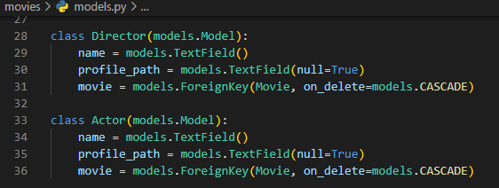

    - models.py에 Director, Actor 클래스를 작성한다.

      

    - dump_maker.py를 만들어서 감독과 배우의 정보를 가져와 DB에 입력하여 dump한다.

      

    - 감독 : dumpdata로 DB에서 데이터를 추출한 이후, loaddata로 데이터를 받아 DB에서 확인한 모습 

    

    - 배우 : dumpdata로 DB에서 데이터를 추출한 이후, loaddata로 데이터를 받아 DB에서 확인한 모습 

    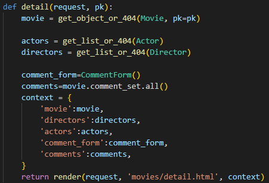

    - 실제 화면에서 볼 수 있게 views.py에서 임시 화면 구성

    

    -  실제 감독, 배우들을 출력한 화면

  - 화면구성 -> 오후로 일정 변경


##### - 5월 23일(월) 오후

-------------------


  - 화면 구성 아이디어 회의 및 간단한 배치(향후 수정)

    

    - 로고, navBar(로그아웃, 회원정보수정, 회원탈퇴 등), 영화 포스터, 제목, 링크 등 설정하기

    

    - 영화 제목 클릭 시 title, overview, Director, Actor등이 담긴 Detail 페이지로 이동

  - 모델 - 영화, 감독, 배우의 테이블 구현

    

    - Movie, Director, Actor 및 Comment 모델 항목 보완

    

    - db.sqlite3에 저장된 테이블의 속성들


---------------------------


__Trouble Shooting__

- 문제상황 1 : BASE_URL 초기화 현상 발생

  - 원인 : 2중 포문을 사용하면서 BASE_URL 초기화

    ```python
    BASE_URL = 'https://api.themoviedb.org/3'
    BASE_URL = 'https://api.themoviedb.org/3/movie/'
    BASE_URL = 'https://api.themoviedb.org/3/person/'
    ```

    이러한 형태로 같은 변수명을 사용하다보니, 할당된 값이 의도치 않게 바뀌었습니다.
    
  - 해결 방안 : 각각 다른 변수명을 사용
  
    ```python
    BASE_URL = 'https://api.themoviedb.org/3'
    BASE_URL2 = 'https://api.themoviedb.org/3/movie/'
    BASE_URL3 = 'https://api.themoviedb.org/3/person/'
    ```
  
    
  
  - 느낀점 : path 변수명을 이용해서 조금 더 구체적으로 작성했으면 BASE_URL 변경 없이 클린코드를 작성할 수 있을 것이라 판단했습니다.
  
    ```python
    BASE_URL='https://api.themoviedb.org/3/'
    path = ['/movies', '/person', '/credits']
    params = {
        'api_key' : 'b423b9f62c2dcbbc988e246c89249738',
        'language' : 'ko-KR',
    }
    ```


- 문제상황 2: 같은 값이 Movie_id별로 5개씩 중복돼서 Json파일로 반환되는 현상 발생
  - 원인: fields명 위치가 잘못되어, 같은 fields에 계속해서 새로운 값을 덮어씌우고 있었음
  - 해결방안 : 첫번째 for문 뒤에 선언되어있던 fields명을 두번째 for 문 뒤로 변경
    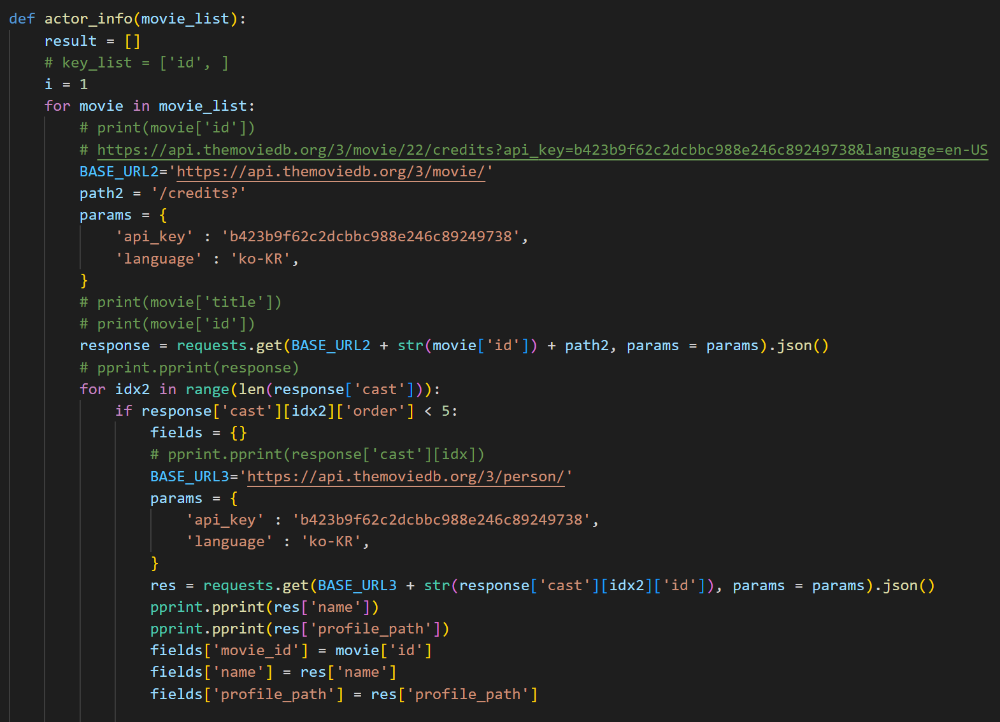
  - 느낀점 : 디버깅의 중요성, 한 줄 한 줄 눈으로 코드를 확인하면서 어느 부분이 잘못되었는지 계산해보았습니다. 같은 값이 반복될 때는 변수의 위치가 정확한지 한번 더 확인하는 습관을 길러야겠습니다.

##### - 5월 24일(화) 오전

-------------------


 - 알고리즘 설계 피드백, 회의를 통한 보충
   - 좋아요를 바탕으로 '~를 좋아하신다면 추천!'의 형식으로 추천 알고리즘 보충
   - 그 외 추천 알고리즘 관련 추가 회의 진행
     - 좋아요도 세분화하여 감독, 배우, 영화에 따라 각각 추천하는 알고리즘 고려
     - 사용자의 의도와 반대로 작용하여 색다른 경험을 주는 게임 형식의 추천 고려

 - 화면 구성 아이디어 회의를 통해 화면 구성을 임시로 적용함.


- 첫 시작 화면 구성

  - navBar

    - 좌측 : 로고, 홈, 추천영화, 커뮤니티
    - 우측 : 사용자 인사, 프로필, 로그아웃 등

  - 배경 적용을 통하여 직접 영화관에 온 듯한 효과

  - Carousel을 이용하여 시간마다 영화 추천 영역이 넘어가면서 변경된다.

  - 영화 포스터를 누르면 상세페이지로 이동한다.

    

- 디테일 페이지 구성

  - 상세 페이지로 이동함과 동시에 유튜브 영상이 자동재생된다.
  - Container 구성
    - 왼쪽 : 영화 포스터
    - 오른쪽 : 영화 제목, 평점, 장르, 개봉일, 줄거리, 감독 라인업(사진, 이름), 배우 라인업(사진, 역할, 이름)을 배치한다.
    - 아래쪽에 댓글 창을 만들어 간단한 리뷰 형식의 댓글을 달 수 있도록 한다.
    - 배경화면으로 backdrop_path를 활용한다.

- 그 외 페이지(로그인, 회원가입, 영화추천, 커뮤니티 등) 작성 예정

##### - 5월 24일(화) 오후

-------------------


 - 모델을 구현하고, 기존 ERD에서 작성한 models.py의 속성값 보충
 - 로그인, 로그아웃 기능 구현
   - 디자인적 요소 추후 작성 필요, form.as_p의 양식을 바꾸어야 함
 - 유저 CRUD는 명세서 상 admin에서만 작성하는 기능으로, 제외하기로 하였음
 - 댓글 CRUD의 경우, 영화 리뷰형식으로 남기도록 구현하였음
 - 추천 알고리즘 작성에 핵심이 되는 좋아요를 우선적으로 구현하기로 함.
 - movies/models.py 


 - articles/models.py 


 - 개인 작업 내용(조영훈)

__비동기 구현을 위한 axios 설치__

```bash
npm install axios
```

__axios와 아이콘 사용을 위해 base.html에 cdn 추가__

```html
<script src="https://cdn.jsdelivr.net/npm/axios/dist/axios.min.js"></script>
<script src="https://kit.fontawesome.com/6725d2d4bc.js" crossorigin="anonymous"></script>
```


__관리자 유저에게 CREATE 권한 부여__

- createsuperuser로 관리자 계정 생성 후, is_staff 속성이 1인 것을 확인

  ```bash
  python manage.py createsuperuser
  ```


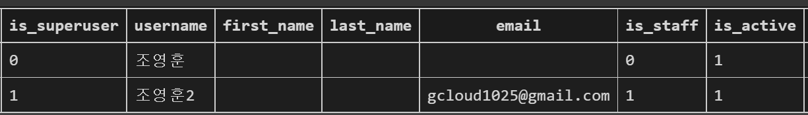

- index.html에서 user.is_staff 속성에 따라 CREATE 버튼 노출

  ```html
  
      <a href="">[CREATE]</a>
  
  ```


__감독 좋아요 & 배우 좋아요__

- DB 내 director_id와 actor_id가 없음을 확인. Model 수정

  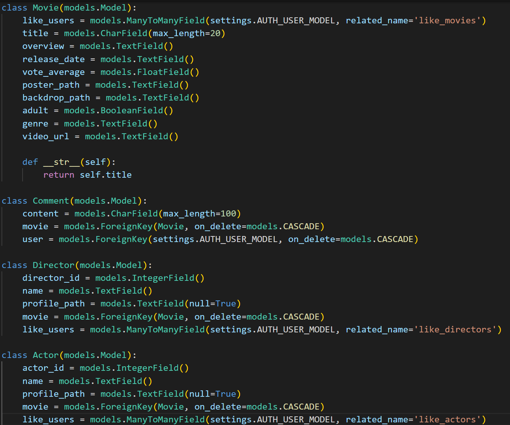

- 양식에 맞게 Json 재생성 및 DB 반영


----------------

__TROUBLE SHOOTING__

- 로그인하지 않은 상태에서 영화 좋아요를 눌렀을 때, 서버에서는 login으로 이동한다고 나오지만 브라우저에서는 로그인 페이지로 이동되지 않는 문제 발생

  - 원인 : 비동기처리와 새 페이지 렌더링은 모순 관계였기 때문입니다. axios 비동기통신은 모든 화면을 렌더링하고 데이터 하나만 바꾸기 위해서 존재하는데(새로고침 없이), 비로그인 시 accounts/login.html로 새로운 페이지를 전체 렌더링하는 요청을 보냈기 때문에 페이지 변화가 없었던 것입니다.

  - 해결 방안 : index.html 내 비로그인 유저라면, 아예 좋아요 기능이 활성화되지 않도록 바꾸었습니다.

    ```html
    
        <div>
            <form class="like-form" data-movie-id="{{ movie.pk }}">
                
                
                  <button>
                    <i id="like-{{ movie.pk }}" class="fa-solid fa-heart" style="color:red"></i>
                  </button>
                
                  <button>
                    <i id="like-{{ movie.pk }}" class="fa-solid fa-heart" style="color:black"></i>
                  </button>
                
            </form>
        </div>
    ```


- 감독 좋아요 버튼을 눌렀을 때, 404 오류, 페이지를 찾지 못하는 현상

  - 원인 : get_object_or_404에서 director를 불러오지 못했음. pk=director_pk로 명시되어있어 index=director_고유번호 식으로 설정해두어 DB에서 찾지 못했습니다.

  - 해결 방안

    ```python
    director = get_object_or_404(Director, director_id=director_pk)
    ```


- 감독 좋아요 & 유저 매핑 시, director_id가 아니라 index와 결합되는 현상 발생

  - 원인 : 모델 설계 실수. Movie의 경우에도, id필드를 따로 설정하지 않고 받아왔었는데 Director와 Actor는 director_id와 actor_id를 따로 받아왔기 때문에 index와 id가 같이 DB에 저장되어 혼동됐다.

  - 해결 방안

    

    1. 모델 재설계 - Director_id와 Actor_id 삭제
    2. Views.py 재설계 - director_id가 아니라 pk로 복구


##### - 5월 25일(수) 오전

----------------

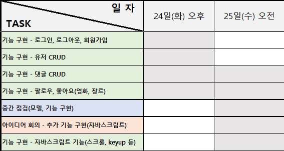

- 로그인, 로그아웃, 회원가입 기능 구현

  - 기존의 HTML 페이지로 구현한 것(form.as_p)에서 modal 구현으로 변경 및 배치

   - 변경 전

     
     

   - 변경 후
     

    
    

  - 댓글 CRD 구현

    

    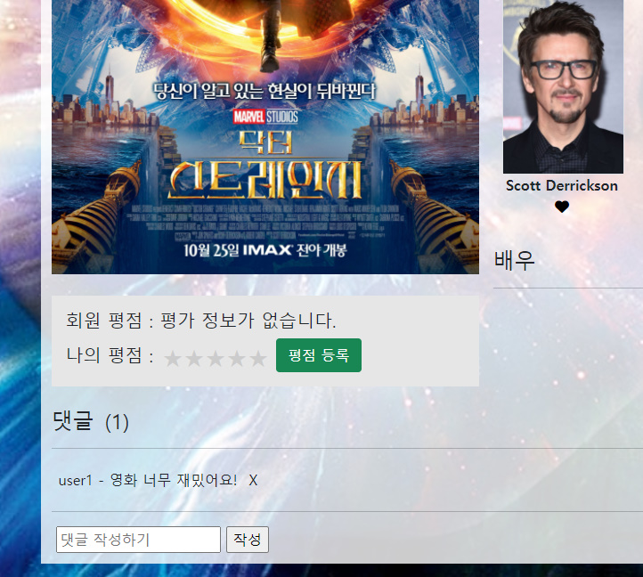

  - 팔로우와 좋아요 중, 좋아요 기능에 집중하여 로그인한 회원에 한하여 좋아요 기능 구현(오후)

- 중간 점검

  - 화면 구성 점검 및 세세한 디테일 회의 및 설정
    - 초기화면 설정
      - 메인 배경의 투명도 -> 메인 배경 투명도 없애고 인기 영화, 추천 영화 div 부분에 투명도 적용
      - 메인 화면에서 navBar 투명하도록 설정
      - 로그인, 회원가입의 모달 배치, 홈, 추천영화, 커뮤니티 배치 
    
    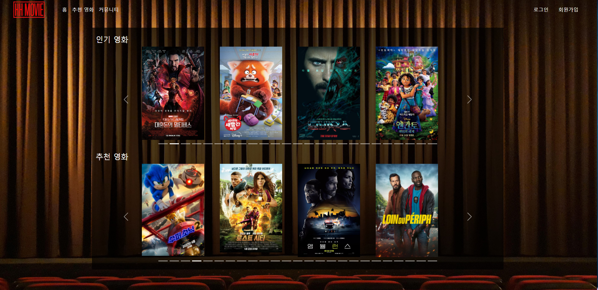

- 자바스크립트 요소 작성

  - 현재 페이지의 scroll 길이에 따라서 navBar의 class 추가/삭제를 통한 투명도 조절 효과
  
  
  
  
  
  - 그 외 자바스크립트 효과에 대한 추가 회의 예정
  
  

##### - 5월 25일(수) 오후

----------------

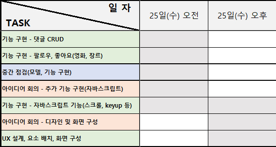

 - 디자인 및 화면 구성

      - title 옆에 작품 개봉연도 표시, 개요 표시, API에서 받아온 평점을 구간별로 나누어 표현
      - 로그인시 좋아요를 누를 수 있는 하트 생성(인물 사진을 클릭하는 것으로 반응)
      - HH MOVIE 회원들이 부여한 평점을 볼 수 있고, 평점이 없을 시 평가 정보가 없다는 안내
      - 나의 평점 부여를 통해 평점을 등록, 수정, 삭제할 수 있는 기능 구현 중
      - 비로그인 시 화면

      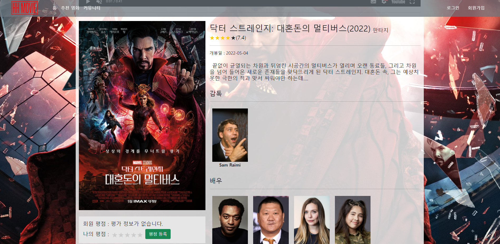

      - 로그인 시 화면
      

 - UX 설계, 요소 배치, 화면 구성 등

​		- 25일(수), 금일 안에 작성 예정 

------------------------------

__TROUBLE SHOOTING__

- 여러 영화에 출연한 배우의 영화들이 1개씩밖에 매칭되지 않는 현상 발생. DB를 확인했을 때, 배우-영화가 1:1로 매칭되고 있음을 확인했음.

  - 원인 : 1:M테이블로 영화 속성을 Foreign Key로 가져왔기 때문. Actor_id가 Primary Key로 동작하고 있었다. 그래서 아래 그림처럼, 기존 영화들이 계속해서 삭제되는 현상이 발생했습니다.

    ```
    배우1_ID(PK) : 영화1
    배우1_ID(PK) : 영화2
    
    # result
    배우1_ID(PK) : 영화2
    ```

  - 해결 방안: MTM 테이블을 구현하여 해당 문제를 해결했습니다.


- MTM 테이블 구현 시, 무결성 제약조건 위반 문구 발생 & 데이터 삽입이 되지 않음

  - 원인 : 배우 테이블에서 Movie 테이블을 참조하는 movies 필드를 작성했는데, Movie 테이블에 필드가 많아 어느 부분에서 무결성 제약조건이 위배되는지 찾기가 어려웠습니다.
  - 해결 방안 : 필드가 많은 Movie 테이블에 actors 필드를 MTM 참조 형식으로 변경하여, 디버깅이 쉬운 구조로 변경했습니다.

  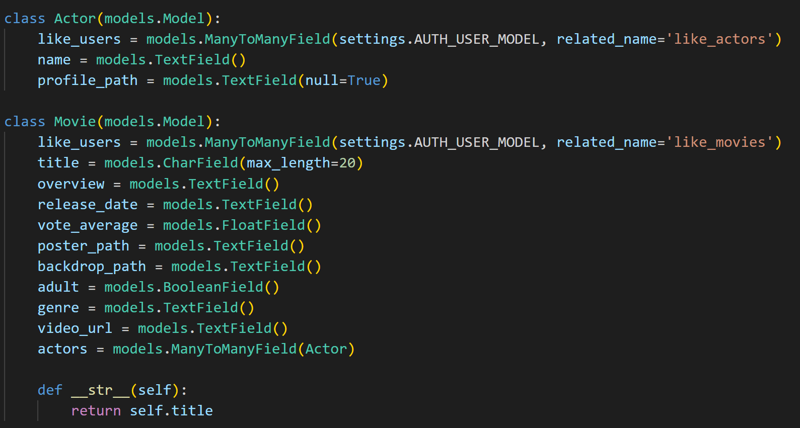


- MTM 테이블에 맞는 Json 파일 구조 문제

  - 원인 : 기존 Json파일이 모델링 및 로드데이터 작업에 적합하지 않았기 때문입니다.

  - 해결 방안 : PJT09 내 fixtures 파일을 참조하여 구조를 다시 잡았습니다.

    __기존 Json 파일 구조__

    

    __새로운 Json 파일 구조__

    

__MTM 테이블 구현 결과물__

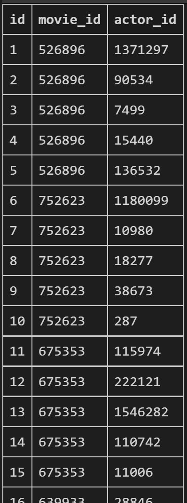

##### - 5월 26일(목) 오전, 오후(최종 점검, 보완 및 피드백 등으로 인하여 구분하지 않음)

----------------

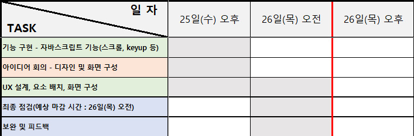

 - UX 설계, 요소 배치, 화면 구성

   - Modal의 경우, 실행될 때 이벤트 리스너를 통해 autofocus가 되도록 만듦.

   

   

   

   - 로그인 창에서 회원가입으로, 회원가입 창에서 로그인으로 이동할 수 있게 구성

   

    - 지저분했던 홈 화면의 carousel indicator 정리, 한 화면에 4x10의 40개 자료까지만 노출되도록 설정, indicator 가운데 정렬되도록 재배치

   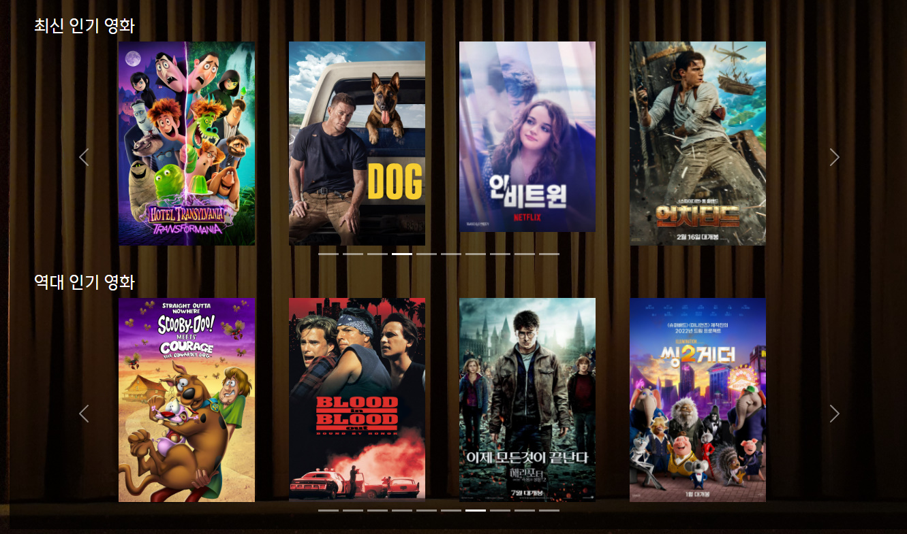

   

   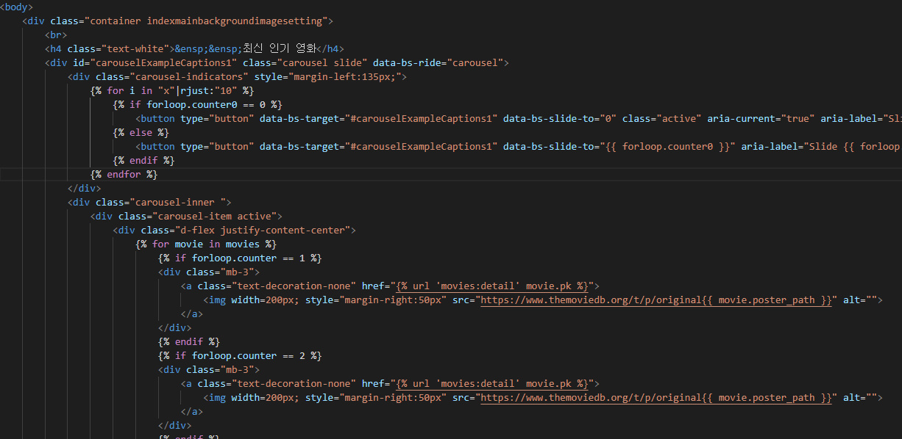

    - 검색창에서 제목, 내용을 검색할 수 있으며 돋보기 아이콘 설정을 통한 시각적인 효과, 검색창 투명도 조절

      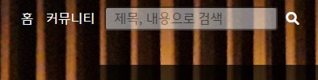

      

    - 검색한 결과의 존재 여부에 따라서 사용자 경험 일치하도록 설정(어벤져스O, 어벤져수X)

   

   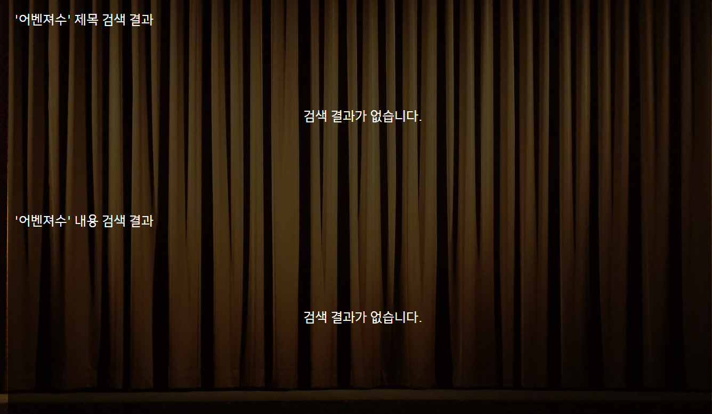

   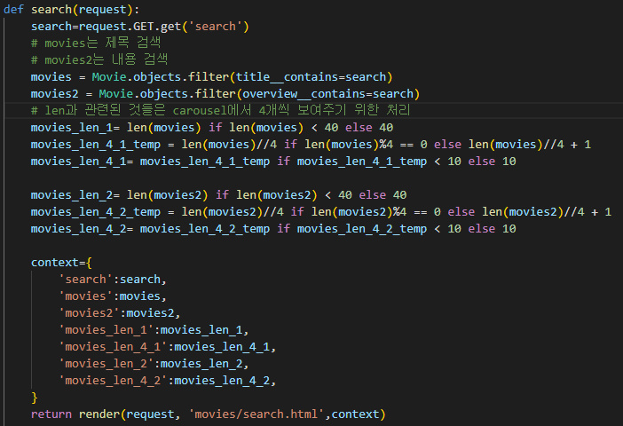

   - 무식하지만 투박한 처리를 통해 사용자 경험을 유지하였다.

   

   

    - 내 프로필로 이동하였을 때, 내 페이지에서 좋아요 누른 감독, 배우, 내 커뮤니티 게시글, 영화 댓글, 평점을 준 영화 확인 가능
      - 내 커뮤니티 게시글과 링크 연결
      - 내 영화 댓글과 영화 정보 링크 연결
      - 평점을 준 영화에서 포스터를 클릭하여 영화 이동

   

    - 다른 사용자의 경우 바뀌는 항목들, 내용이 없을 때 분기 처리, 관리자 계정이라면 (관리자)로 표현

      

    - 각종 링크들과 게시글이 없을 때 분기 처리

   

    - 좋아요를 눌렀을 때 하트 반영

      

    - 평점 - 회원 평점이 하나도 없는 경우

      - 평가 정보가 없다는 내용을 띄워 사용자 경험 유지

      

    - 평점 - 별 4개에 클릭한 경우(등록하지 않은 상태)

      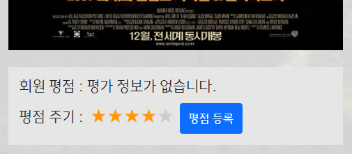

    - 평점 - 평점을 등록한 경우

      - 회원들이 준 평점을 별, 숫자, 평점을 준 사람 수로 표현

   

    - 평점을 보여주기 위한 구간 및 반복처리

   

    - 평점 - 평점을 삭제한 경우

   

    - 댓글 - 댓글 작성자를 작성자 프로필과 링크 연결

    - 댓글의 수를 댓글 옆에 표현

      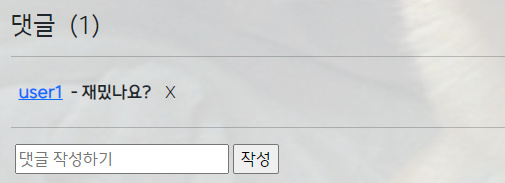

    - 자유게시판 (커뮤니티)

      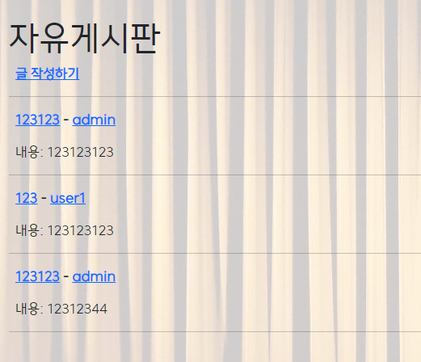

      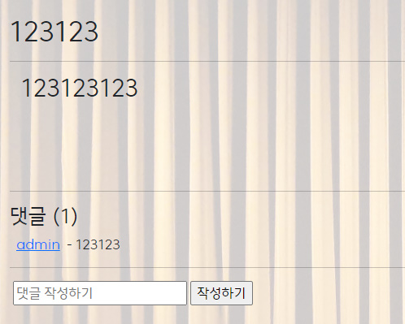

    - 커뮤니티를 자유게시판 형태로 구성

      - 게시글 제목을 게시글 내용과 링크 연결(자세히 보기, 게시글 이동)
      - 작성자 이름을 작성자 프로필과 링크 연결
      - 게시글의 댓글의 경우, 댓글 작성자 프로필과 링크 연결
      - 댓글의 수를 댓글 옆에 표현

 - 추천 알고리즘 완성 및 보충

   - 추천 알고리즘 전체 항목(views.py)

     

   - DB의 전체 영화에서 랜덤으로 4x10개를 추출하여 제공
   
     
   
   - 사용자가 좋아요한 감독의 영화들을 추천 
   
     
   
   - 사용자가 좋아요한 배우의 영화들을 추천
   
     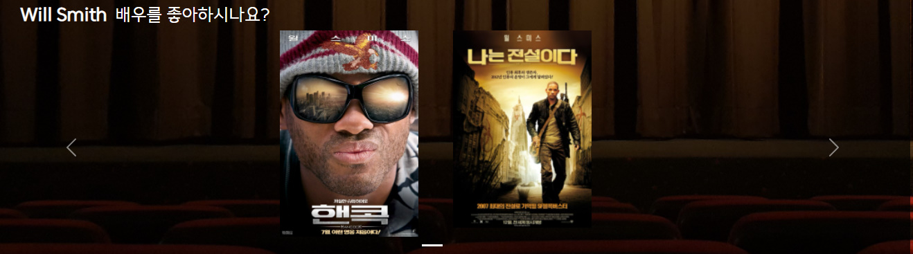
   
   - 사용자가 가장 높은 평점을 준 영화의 장르를 추천(이 장르의 영화를 가장 좋아했기 때문)
   
     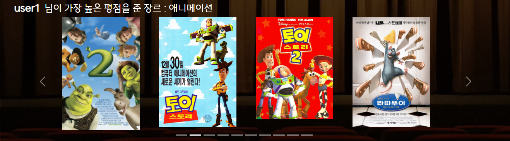
   
   - 사용자가 평점 4점 이상을 준 영화 중 가장 많은 영화 장르를 추천
   
     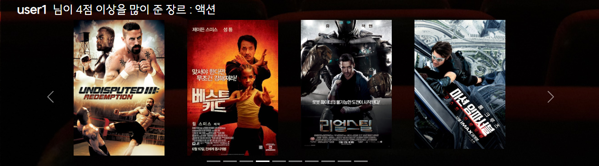
   
   - 좋아하는 감독, 배우가 없을 때, 평점을 높게 준 영화, 4점 이상을 준 영화들이 없을 때 사용자 경험 유지
   
     
   

