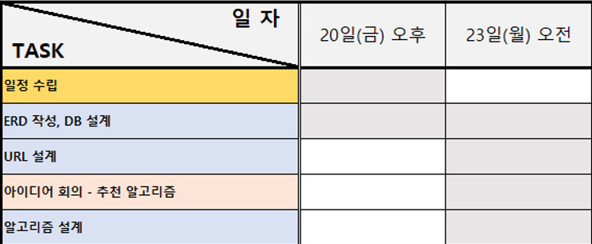
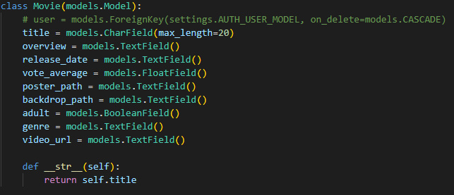
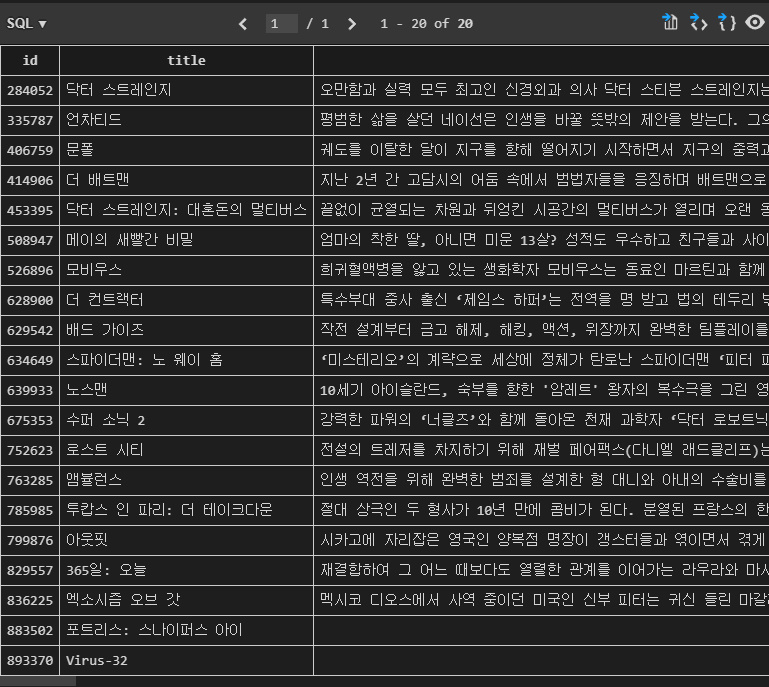
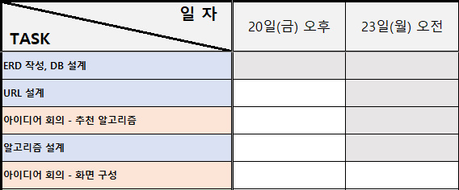
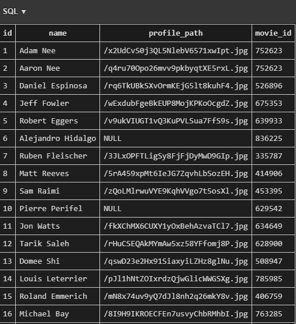
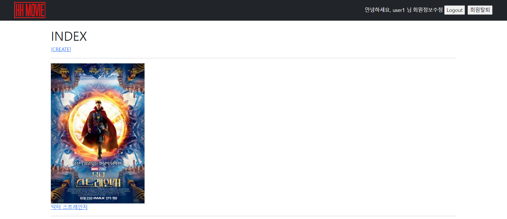
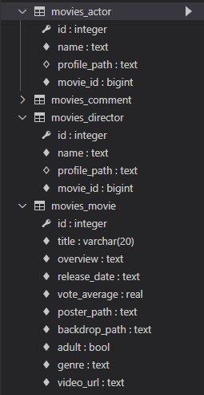

### HH MOVIE 프로젝트

----------------
#### 1. 팀원 정보 및 업무 분담 내역
- 이준호 - 팀장

	- 프론트엔드 담당, 
- 조영훈
  - 백엔드 담당, 


#### 2. 일정 계획 표


##### - 일정 수립(5월 20일(금) 오후)

##### - 최종 점검(5월 25일(수) 오전)

##### - 중간 점검(5월 26일(목) 오후)


#### 3. 일자별 활동(일자별 업데이트 예정)

##### - 5월 20일(금) 오후

----------------



- 프로젝트 기간(05.20 ~ 05.26) 일정 수립(오전, 오후 분할)


  - 1차 중간 점검 이전(~ 5월 25일(수) 오전) : 일정 수립, 아이디어 회의, 모델/기능 구현
  - 최종 점검 이전(~ 5월 26일(목) 오후) : 아이디어 회의, 기능 구현, 디자인 요소
  - 보완 및 피드백(5월 26일(목) 오후)


- ERD 작성, DB 설계(업데이트 예정)


  - TMBD API 자료에서 영화 DB 반영
    - title
    
    - overview
    
    - genre(genre_ids에서 도출)
    
    - poster_path
    
    - video_url 등




  - dumpdata, loaddata로 데이터 저장하기, 불러오기 확인




  - 아이디어 회의
    - 추천 알고리즘을 어떻게 구성하면 좋을 것인가?
      - 코딩 관련된 영화를 추천해도 될 것 같다.
      - 알고리즘을 여러 개를 구현하여 재미를 주어도 좋겠다.
      - 사용자의 의도와 반대로 작용하여 색다른 경험을 하게 만드는 것도 재미있을 것 같다.
    - 기능 상 구현하고 싶었던 것은 무엇이 있는가?
      - 회원가입시 사용자의 지역을 정보로 받아, 현재 상영영화일 경우 예매처로 이동할 수 있게 만들었으면 좋겠다.
    - 이스터에그와 같은 독특한 경험도 주었으면 좋겠다.
    - 디자인적 요소의 경우, UX가 좋다고 평가되는 다른 OTT 서비스를 참고하여도 좋을 것 같다.
    
    

##### - 5월 23일(월) 오전

---------------------




  - ERD 보충 : models.py의 model 구현에 알맞게 테이블의 인스턴스 변경

  - DB 설계를 위한 dumpdata, loaddata 과정 준비

  - 영화 DB 완성을 위한 감독, 배우의 정보 불러오는 과정

    

    - models.py에 Director, Actor 클래스를 작성한다.

      

    - dump_maker.py를 만들어서 감독과 배우의 정보를 가져와 DB에 입력하여 dump한다.

      

    - 감독 : dumpdata로 DB에서 데이터를 추출한 이후, loaddata로 데이터를 받아 DB에서 확인한 모습 

    

    - 배우 : dumpdata로 DB에서 데이터를 추출한 이후, loaddata로 데이터를 받아 DB에서 확인한 모습 

    

    - 실제 화면에서 볼 수 있게 views.py에서 임시 화면 구성

    

    -  실제 감독, 배우들을 출력한 화면

  - 화면구성 -> 오후로 일정 변경


##### - 5월 23일(월) 오후

-------------------


  - 화면 구성 아이디어 회의 및 간단한 배치(향후 수정)

    

    - 로고, navBar(로그아웃, 회원정보수정, 회원탈퇴 등), 영화 포스터, 제목, 링크 등 설정하기

    

    - 영화 제목 클릭 시 title, overview, Director, Actor등이 담긴 Detail 페이지로 이동

  - 모델 - 영화, 감독, 배우의 테이블 구현

    

    - Movie, Director, Actor 및 Comment 모델 항목 보완

    

    - db.sqlite3에 저장된 테이블의 속성들


---------------------------


__Trouble Shooting__

- 문제상황 1 : BASE_URL 초기화 현상 발생

  - 원인 : 2중 포문을 사용하면서 BASE_URL 초기화

    ```python
    BASE_URL = 'https://api.themoviedb.org/3'
    BASE_URL = 'https://api.themoviedb.org/3/movie/'
    BASE_URL = 'https://api.themoviedb.org/3/person/'
    ```

    이러한 형태로 같은 변수명을 사용하다보니, 할당된 값이 의도치 않게 바뀌었습니다.
    

  - 해결 방안 : 각각 다른 변수명을 사용

    ```python
    BASE_URL = 'https://api.themoviedb.org/3'
    BASE_URL2 = 'https://api.themoviedb.org/3/movie/'
    BASE_URL3 = 'https://api.themoviedb.org/3/person/'
    ```

    

  - 느낀점 : path 변수명을 이용해서 조금 더 구체적으로 작성했으면 BASE_URL 변경 없이 클린코드를 작성할 수 있을 것이라 판단했습니다.

    ```python
    BASE_URL='https://api.themoviedb.org/3/'
    path = ['/movies', '/person', '/credits']
    params = {
        'api_key' : 'b423b9f62c2dcbbc988e246c89249738',
        'language' : 'ko-KR',
    }
    ```


- 문제상황 2: 같은 값이 Movie_id별로 5개씩 중복돼서 Json파일로 반환되는 현상 발생
  - 원인: fields명 위치가 잘못되어, 같은 fields에 계속해서 새로운 값을 덮어씌우고 있었음
  - 해결방안 : 첫번째 for문 뒤에 선언되어있던 fields명을 두번째 for 문 뒤로 변경
    
  - 느낀점 : 디버깅의 중요성, 한 줄 한 줄 눈으로 코드를 확인하면서 어느 부분이 잘못되었는지 계산해보았습니다. 같은 값이 반복될 때는 변수의 위치가 정확한지 한번 더 확인하는 습관을 길러야겠습니다.


