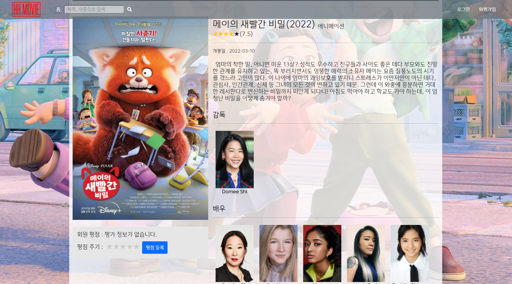

## 목차✔

- 프로젝트 소개

- 팀원 소개

- 프로젝트 명세

  - 프로젝트 목표

  - 프로젝트 개요

  - 개발 환경

  - 개발 일정

  - ERD

  - 추천 알고리즘 설명

- 주요 기능

  - accounts

  - movies

- 느낀점

- 프로젝트 필수 명세와 비교

- 프로젝트 Day by Day  

- 프로젝트 사용 주의사항

  

## 프로젝트 소개

> 요새들어 영화 사이트는 너무 많은데, 우리라고 못 만들까?? 더 잘 만들 수 있지!😎


영화 사이트가 난무하는 요즘, 저희가 만들고싶은 사용자 경험을 직접 재현해보고자 시작하였습니다!

흐흐 무비와 함께 ~편안~한 마음으로 영화를 선택하실 준비가 되셨나요?

-------------------------

SSAFY 광주 2반에서 배운 내용을 고루 담아 보여드리고자 합니다. (비전공 Python반)

2022년 1월부터  5월까지 약 5개월 간의 배운 실력을 마음껏 뽑내보겠습니다!!


## 팀원 소개

|         |                    |
| ---------------------------------- | --------------------------------------------- |
| 이준호 (팀장) 😀                    | 조영훈 (팀원) 😃                               |
| FE : HTML, CSS 디자인, UI, UX 설계 | BE : 데이터 핸들링(수집, 처리), 알고리즘 구현 |


## 프로젝트 명세

- 프로젝트 목표
   - 영화 데이터 기반 추천 서비스 구성

   - 영화 추천 알고리즘 구성

   - 커뮤니티 서비스 구성

   - HTML, CSS, Django, REST API, Database를 활용한 실제 서비스 설계

     

- 프로젝트 개요

   - 영화 데이터 수집

     - The Movie Database(TMDB)를 활용한 데이터 수집, 가공하여 데이터베이스화


        
    
     - Django REST Framework를 활용한 URL 렌더링, DTL 사용
    
         
    
     - SSAFYlab을 활용한 소스코드 버전 관리


- 프로젝트 폴더 구성

```
├── README.md
├── accounts
│   ├── migrations
│   ├── static
│   │   └── accounts
│   │       ├── ALT_IMAGE.png
│   ├── templates
│   │   └── accounts
│   │       ├── profile.html
│   │       ├── login.html
│   │       ├── change_password.html
│   │       ├── signup.html
│   │       └── update.html
│   ├── admin.py
│   ├── apps.py
│   ├── forms.py
│   ├── models.py
│   ├── tests.py
│   ├── urls.py
│   └── views.py
├── articles
│   ├── migrations
│   ├── templates
│   │   └── accounts
│   │       ├── create.html
│   │       ├── detail.html
│   │       ├── index.html
│   │       └── update.html
│   ├── admin.py
│   ├── apps.py
│   ├── forms.py
│   ├── models.py
│   ├── tests.py
│   ├── urls.py
│   └── views.py
├── dump_maker
│   ├── dump_maker_actor.py
│   ├── dump_maker_director.py
│   ├── dump_maker_movie.py
├── hh_movie
│   ├── asgi.py
│   ├── settings.py
│   ├── urls.py
│   └── wsgi.py
├── hh_movie_store
│   ├── etc
│   ├── README
│   └── schedule
├── movies
│   ├── fixtures
│   │   ├── actor.json
│   │   ├── actor2.json
│   │   ├── actor3.json
│   │   ├── actor4.json
│   │   ├── director.json
│   │   ├── movie.json
│   │   ├── movie2.json
│   │   └── movie3.json
│   ├── migrations
│   ├── static
│   │   └── movie
│   │       ├── ALT_IMAGE.png
│   │       ├── BACKGROUNDIMAGE.jpg
│   │       ├── LOGO_INVISIBLE.png
│   │       ├── LOGO.jpg
│   │       └── LOGO.png
│   ├── templates
│   │   └── movie
│   │       ├── create.html
│   │       ├── detail.html
│   │       ├── index.html
│   │       ├── recommend.html
│   │       ├── search.html
│   │       └── update.html
│   ├── admin.py
│   ├── apps.py
│   ├── forms.py
│   ├── models.py
│   ├── tests.py
│   ├── urls.py
│   └── views.py
├── templates
│   └── base.html
├── .gitignore
├── README.md
├── manage.py
├── package-lock.json
├── package.json
└── requirements.txt
```


- 개발 환경

  - Server & Client(Django)

  

  - Database(SQLite3)

    

    

- 개발 일정

  - 2022.05.20(금) ~ 2022.05.26(목) (주말 제외 5일)

  

  

- ERD

  

- 추천 알고리즘 설명

  - 랜덤 추천

     - DB의 모든 영화 중 랜덤으로 4 x 10 개, 총 40개를 랜덤으로 추출

     

  - 좋아하는 감독의 작품들을 추천

     - 좋아하는 감독이 여럿일 경우, 랜덤 추출

     

  - 좋아하는 배우의 작품들을 추천
       - 좋아하는 배우가 여럿일 경우, 랜덤 추출

    

  - 가장 높은 평점을 준 영화 장르를 추천

    - 동일 시 랜덤 추출

    

  - 평점을 높게 준 영화가 많은 장르를 추천

    - 기준은 평점 4점 이상

    


 ## 주요 기능


- accounts

     - 회원가입, 로그아웃, 로그인

       

       - 로그인 클릭 시 Modal이 팝업, 로그인 Modal과 회원가입 Modal 상호 이동 가능
         - 로그인 창 '처음 오셨나요?' -> 회원가입 창 '아이디가 있으신가요?' 반복 가능
       - Modal 팝업 시 아이디 창에 자동 focus()
       - 로그인 하면 안녕하세요 user님 이라는 글 추가
       - 비로그인 메뉴(홈, 검색)에서 로그인 메뉴(홈, 영화추천, 커뮤니티) 변경

       

     - 프로필, 자유게시판, 자유게시판-댓글

       

       - 내 프로필 - 내가 좋아요 누른 감독, 배우, 나의 커뮤니티 게시글, 영화 댓글, 평점을 준 영화 확인 가능

       - 내 커뮤니티 게시글을 통해 게시글로 이동 가능, 댓글에 달린 작성자의 링크로 작성자 프로필로 이동 가능

       - 게시판 글 수정 및 삭제, 뒤로가기, 게시글에 댓글 달기 가능

       - 내 프로필과 기타 사용자의 프로필 항목의 주제가 다르게 표현(내가 ~ -> ~님이)

       - 평점을 준 영화 포스터 클릭 시 영화 상세 페이지로 이동 가능

         

- movies

   

 - 홈에서 최신 인기영화, 역대 인기 영화 확인

      - 4개씩 총 40개 영화 리스트 carousel 반복

 - 추천 영화에서 알고리즘에 따른 영화 추천

      - 앞서 서술한 알고리즘에 따른 영화 추천 및 carousel 반복

 - 검색 창을 통해 제목, 내용에 검색 내용 출력

      - 제목, 내용에 해당 검색어가 있을 시 영화 출력


​            

 		

 - 영화 포스터 클릭시 detail로 이동
 - detail 페이지에 담긴 내용
   - 유튜브 영상(티저, 예고편, 축하영상 등)
     - 포스터
     - 영화제목(개봉연도)
     - 장르
     - TMDB 평점(별, 숫자)
     - 개봉일
     - 줄거리
     - 감독 정보(사진, 이름)
     - 배우 정보(사진, 이름)
     - 감독 / 배우 사진 클릭을 통해 좋아요
     - HH MOVIE 회원 평점(별, 숫자, 평가한 회원 수)
     - 평점 주기
     - 댓글(댓글 수)
     - 댓글 달기


- User-Friendly Contents & User-Experience(UX)


     - carousel을 통하여 많은 갯수의 영화를 자연스레 노출 가능, 항목이 적을 시 carousel 이동 X
    
     


     - scroll 길이에 따른 navBar 상태 변화 
    
        
    
     - 투명도 조절을 통한 자연스러운 연출(전체배경, navBar, 검색창, 영화 배경사진, detail page) + 회원 평점 영역은 잘 보이도록 불투명화
    
        
    
     - 각종 링크를 통한 프로필, 게시판 이동
    
        


     - 포스터 클릭을 통해 detail 페이지로 이동
    
        
    
     - 검색 결과가 없을 시 사용자 경험 유지
    
        
    
     - 추천 알고리즘에 해당하지 않을 시, 추천을 유도하여 사용자 경험 향상
    
        
    
     - 영화(개봉연도), 회원평점(평가한 회원 수), 댓글(댓글 수) 등 부가적인 정보 표시
    
        
    
     - 평점을 별로써 작성, 수정, 삭제할 수 있다.
    
    			

## 느낀점😊


- 이준호

     ```
     - 팀장과 팀원으로 이루어진 작은 팀이지만, 팀장의 마음가짐과 해야할 일, 계획 및 실천, 팀원과의 협업 및 지시 등에 대해 생각할 수 있는 시간이었습니다.
     
     - 원하는 기능들을 넣다보니(게시글 작성자를 넣었더니 링크도 달고 싶다 등) 자꾸만 욕심이 생겨서 일정에 차질이 생겼습니다. 이를 팀원들과 조율하고 전체 일정에 맞추어 프로젝트를 끝내기 위해 다급히 달려가야 했습니다. 다급히 달려가면서 오류가 생기는 악순환도 발생하였습니다.
     
     - 평소에 백과 프론트에 대한 구분이 잘 안 섰기에 어느 분야로 가야할 지 고민이었지만, 프로젝트를 통해 프론트엔드 쪽 욕심이 있다는 것을 알게 되어, 진로 설계에 큰 도움이 되었습니다. 
     
     - 사용자 경험이란 끝도 없다는 것을 느꼈습니다. 인간의 본능은 서있으면 앉고싶고~ 그런거라던데, 유저-친화적, 또는 유저 경험 등을 향상시키기는 무궁무진한 가능성이 있지만 또 그만큼 어렵다는 것도 알게 되었습니다.
     
     - 초기 DB 설계를 하면서 '일단 하고 넘어가자~ 다음에 다시 바꾸면 괜찮을거야~' 라는 마인드가 상당히 잘못되었음을 뼈저리게 느꼈습니다. 그만큼 초기 설계가 중요하고, 이를 회복하고 극복하려면 더 많은 시간과 자원을 투자해야함을 알게 되었습니다.
     
     - 온라인 PJT였지만 프로그래밍할 때마다 매번 서로 캠을 켜고 진행하였습니다. 목소리만 듣고 진행하는 것보다 캠이 켜져있어 얼굴을 마주하고 얘기하며 한다는 것이 큰 차이가 있어 더욱 열심히 할 수 있었고, 무리한 일정에 많은 컨텐츠와 욕심을 소화해냈던 것은 팀원과의 협업이 아니면 불가능했으리라 생각합니다.
     ```

- 조영훈

     ```
     - 다양한 Trouble Shooting을 겪으면서 답답하기도 했지만, 인터넷에서 찾아보고 기존 교재를 복습하면서 프로그래밍에 대한 이해도를 높일 수 있었습니다. 특히, 오류가 났을 때 어느 부분에서 오류가 났는지 점검하고 이를 수정하면서 개발자의 마음가짐을 익힐 수 있었습니다.
     
     - 개발자에게 왜 협업 능력이 가장 중요하다고 언급되는지 체감했습니다. 초기 구성부터 최종 완성까지 모든 단계가 힘들었지만 결국 끝까지 해낼 수 있었던 것은 이준호 페어가 있었기 때문입니다. 서로 의지하고 독려하면서 저와 이준호 페어 모두 함께 일하는 방법과 중요성을 배웠으리라 자신합니다.
     
     - 초기 설계가 중요하다고 느꼈습니다. 처음에 ERD를 구성하고 모델링한 뒤, 이를 DB에 반영했지만 페어와 저 모두 욕심이 생겨 추가적인 기능을 구현하게 되었습니다. 이러한 과정에서 모델링 수정과 API 덤핑 등 불필요한 작업이 반복되었습니다. 다음 프로젝트부터는 초기에 명확하게 목표 기능과 모델링 설계 마치고 효율적으로 프로그래밍을 해야겠습니다.
     ```

     

## 프로젝트 필수 명세와 비교✔

 - 관리자 뷰

   - 관리자 권한의 유저만 영화 등록 / 수정 / 삭제 권한을 가집니다.

     - 관리자 유저의 경우

     

     - 관리자 유저일 때만 ''새로운 영화 정보 등록하기'가 보인다.
     - 관리자일 경우 안녕하세요 ''관리자'님 표시

     

     

     - 관리자만 등록할 수 있다.

     

     - 관리자일 때만 영화 수정하기, 삭제하기 버튼이 보인다.

     

     

     - 배우를 변경하여서 배우가 1명 뿐임을 확인할 수 있다.

     

     - 삭제를 눌렀을 때 영화가 검색되지 않는다.

     

   - 관리자 권한의 유저만 영화 등록 / 수정 / 삭제 권한을 가집니다.

     - admin 페이지에서 스태프 권한 확인 가능

     

 - 영화 정보

   - 영화 데이터는 Database Seeding을 활용하여 최소 50개 이상의 데이터가 존재하도록 구성해야 합니다.

     - 영화(505개), 배우(1,819명),  감독(495명) 등

       

       

       

   - 로그인 된 유저는 영화에 대한 평점 등록 / 수정 / 삭제 등을 할 수 있어야 합니다.

     - 비로그인인 경우

     

     - 로그인한 경우

     

     - 평점 제출 전/후

       

       

     - 평점을 수정 전/후

       

       

     - 등록한 평점 삭제

       
     
       

 - 영화 추천 알고리즘

   - 영화를 평가한 유저는 해당 정보를 기반으로 영화를 추천 받을 수 있어야 합니다

     - 영화 평점 부여, 감독 좋아요, 배우 좋아요한 경우(엔칸토 감독, 배우 좋아요 상태)

       

     - 감독/배우의 영화 추천에는 엔칸토 감독/배우의 작품 추천이, 

     - 5점을 부여한 장르(엔칸토, 애니메이션), 4점을 부여한 영화가 2개인 장르(호빗, 어벤져스 -> 액션)에 따라 추천 

       

   - 추천 알고리즘의 지정된 형식은 없으나, 사용자는 반드시 최소 1개 이상의 방식으로 영화를 추천 받을 수 있어야 합니다.

     - 5개의 알고리즘(랜덤, 좋아요 누른 감독/배우의 작품, 최대 평점 장르 / 4점 이상 평점 갯수 많은 장르)

   - 추천 방식은 각 팀별로 자유롭게 선택할 수 있으며, 어떠한 방식으로 추천 시스템을 구현 했는지 기술적으로 설명할 수 있어야 합니다.

     - 랜덤 : 전체 DB에서 랜덤 추출
     - 좋아요 누른 감독의 작품 : 
       - Director 테이블에서 user_pk로 좋아요 누른 감독의 id를 필터링 한다.
       - Movie 테이블 전체에서 감독 id와 Director 테이블에서 구한 감독 id가 같게 필터링한다.
     - 좋아요 누른 배우의 작품 : 
       - Actor 테이블에서 user_pk로 좋아요 누른 배우의 id를 필터링 한다.
       - Movie 테이블 전체에서 배우 id와 Actor 테이블에서 구한 배우 id가 같게 필터링한다.
     - 가장 높은 평점의 장르 : 
       - Score 테이블에서 user_pk를 기준으로 필터링하고, 평점을 역순으로 가져온다.
       - 가장 첫번째 movie_id를 가져온다.
       - Movie 테이블 전체에서 genre가 Score 테이블에서 가져온 첫번째 movie_id와 같게 필터링한다.
     - 높은 평점의 갯수가 많은 장르 : 
       - Score 테이블에서 user_pk를 기준으로 필터링한다. 평점이 기준(4점)이상이면 장르의 딕셔너리에 갯수를 추가한다. 값이 가장 큰 genre를 저장한다.
       - Movie 테이블 전체에서 genre가 Score 테이블에서 가져온 값이 가장 큰 genre와 같게 필터링한다.

     

 - 커뮤니티

   - 영화 정보와 관련된 소통을 할 수 있는 커뮤니티 기능을 구현해야 합니다.

     - 자유게시판의 형태로 구성하였음

     

   - 로그인 사용자만 글을 조회 / 생성 할 수 있으며, 작성자 본인만 글을 수정 / 삭제 할 수 있습니다.

     - 비로그인 상태에서는 커뮤니티를 찾을 수 없다.

     

     - 작성자만 본인의 글을 수정/삭제할 수 있다.

       - 사용자 : 이준호1, 글 작성자 : user1

       

       - 사용자 : 이준호1, 글 작성자 : 이준호1

       

   - 사용자는 작성된 게시 글에 댓글을 작성할 수 있어야 하며 작성자 본인만 댓글을 삭제할 수 있습니다.

   - 각 게시글 및 댓글은 생성 및 수정 시각 정보가 포함되어야 합니다.

     - 댓글 작성 및 본인만 삭제, 생성 및 수정 시각 정보 포함

       

 - 기타

   - 최소한 5개 이상의 URL 및 페이지를 구성해야 합니다.
     - 홈, 추천 영화, 검색, 로그인, 회원가입, 영화 상세, 커뮤니티 게시글 등


## 프로젝트 Day by Day

### HH MOVIE 프로젝트(05.20~05.26) 작업 내역

----------------

#### 1. 팀원 정보 및 업무 분담 내역

- 이준호 - 팀장

  - 프론트엔드 담당, 
- 조영훈
  - 백엔드 담당, 


#### 2. 일정 계획 표


##### - 일정 수립(5월 20일(금) 오후)

##### - 최종 점검(5월 25일(수) 오전)

##### - 중간 점검(5월 26일(목) 오후)


#### 3. 일자별 활동(일자별 업데이트 예정)

##### - 5월 20일(금) 오후

----------------


- 프로젝트 기간(05.20 ~ 05.26) 일정 수립(오전, 오후 분할)


  - 1차 중간 점검 이전(~ 5월 25일(수) 오전) : 일정 수립, 아이디어 회의, 모델/기능 구현
  - 최종 점검 이전(~ 5월 26일(목) 오후) : 아이디어 회의, 기능 구현, 디자인 요소
  - 보완 및 피드백(5월 26일(목) 오후)


- ERD 작성, DB 설계(업데이트 예정)


  - TMBD API 자료에서 영화 DB 반영
    - title

    - overview

    - genre(genre_ids에서 도출)

    - poster_path

    - video_url 등


  - dumpdata, loaddata로 데이터 저장하기, 불러오기 확인


  - 아이디어 회의

    - 추천 알고리즘을 어떻게 구성하면 좋을 것인가?
      - 코딩 관련된 영화를 추천해도 될 것 같다.
      - 알고리즘을 여러 개를 구현하여 재미를 주어도 좋겠다.
      - 사용자의 의도와 반대로 작용하여 색다른 경험을 하게 만드는 것도 재미있을 것 같다.
    - 기능 상 구현하고 싶었던 것은 무엇이 있는가?
      - 회원가입시 사용자의 지역을 정보로 받아, 현재 상영영화일 경우 예매처로 이동할 수 있게 만들었으면 좋겠다.
    - 이스터에그와 같은 독특한 경험도 주었으면 좋겠다.
    - 디자인적 요소의 경우, UX가 좋다고 평가되는 다른 OTT 서비스를 참고하여도 좋을 것 같다.

    

##### - 5월 23일(월) 오전

---------------------


  - ERD 보충 : models.py의 model 구현에 알맞게 테이블의 인스턴스 변경

  - DB 설계를 위한 dumpdata, loaddata 과정 준비

  - 영화 DB 완성을 위한 감독, 배우의 정보 불러오는 과정

    

    - models.py에 Director, Actor 클래스를 작성한다.

      

    - dump_maker.py를 만들어서 감독과 배우의 정보를 가져와 DB에 입력하여 dump한다.

      

    - 감독 : dumpdata로 DB에서 데이터를 추출한 이후, loaddata로 데이터를 받아 DB에서 확인한 모습 

    

    - 배우 : dumpdata로 DB에서 데이터를 추출한 이후, loaddata로 데이터를 받아 DB에서 확인한 모습 

    

    - 실제 화면에서 볼 수 있게 views.py에서 임시 화면 구성

    

    -  실제 감독, 배우들을 출력한 화면

  - 화면구성 -> 오후로 일정 변경


##### - 5월 23일(월) 오후

-------------------


  - 화면 구성 아이디어 회의 및 간단한 배치(향후 수정)

    

    - 로고, navBar(로그아웃, 회원정보수정, 회원탈퇴 등), 영화 포스터, 제목, 링크 등 설정하기

    

    - 영화 제목 클릭 시 title, overview, Director, Actor등이 담긴 Detail 페이지로 이동

  - 모델 - 영화, 감독, 배우의 테이블 구현

    

    - Movie, Director, Actor 및 Comment 모델 항목 보완

    

    - db.sqlite3에 저장된 테이블의 속성들


---------------------------


__Trouble Shooting__

- 문제상황 1 : BASE_URL 초기화 현상 발생

  - 원인 : 2중 포문을 사용하면서 BASE_URL 초기화

    ```python
    BASE_URL = 'https://api.themoviedb.org/3'
    BASE_URL = 'https://api.themoviedb.org/3/movie/'
    BASE_URL = 'https://api.themoviedb.org/3/person/'
    ```

    이러한 형태로 같은 변수명을 사용하다보니, 할당된 값이 의도치 않게 바뀌었습니다.

  - 해결 방안 : 각각 다른 변수명을 사용

    ```python
    BASE_URL = 'https://api.themoviedb.org/3'
    BASE_URL2 = 'https://api.themoviedb.org/3/movie/'
    BASE_URL3 = 'https://api.themoviedb.org/3/person/'
    ```

    

  - 느낀점 : path 변수명을 이용해서 조금 더 구체적으로 작성했으면 BASE_URL 변경 없이 클린코드를 작성할 수 있을 것이라 판단했습니다.

    ```python
    BASE_URL='https://api.themoviedb.org/3/'
    path = ['/movies', '/person', '/credits']
    params = {
        'api_key' : 'b423b9f62c2dcbbc988e246c89249738',
        'language' : 'ko-KR',
    }
    ```


- 문제상황 2: 같은 값이 Movie_id별로 5개씩 중복돼서 Json파일로 반환되는 현상 발생
  - 원인: fields명 위치가 잘못되어, 같은 fields에 계속해서 새로운 값을 덮어씌우고 있었음
  - 해결방안 : 첫번째 for문 뒤에 선언되어있던 fields명을 두번째 for 문 뒤로 변경
    
  - 느낀점 : 디버깅의 중요성, 한 줄 한 줄 눈으로 코드를 확인하면서 어느 부분이 잘못되었는지 계산해보았습니다. 같은 값이 반복될 때는 변수의 위치가 정확한지 한번 더 확인하는 습관을 길러야겠습니다.

##### - 5월 24일(화) 오전

-------------------


 - 알고리즘 설계 피드백, 회의를 통한 보충
   - 좋아요를 바탕으로 '~를 좋아하신다면 추천!'의 형식으로 추천 알고리즘 보충
   - 그 외 추천 알고리즘 관련 추가 회의 진행
     - 좋아요도 세분화하여 감독, 배우, 영화에 따라 각각 추천하는 알고리즘 고려
     - 사용자의 의도와 반대로 작용하여 색다른 경험을 주는 게임 형식의 추천 고려

 - 화면 구성 아이디어 회의를 통해 화면 구성을 임시로 적용함.


- 첫 시작 화면 구성

  - navBar

    - 좌측 : 로고, 홈, 추천영화, 커뮤니티
    - 우측 : 사용자 인사, 프로필, 로그아웃 등

  - 배경 적용을 통하여 직접 영화관에 온 듯한 효과

  - Carousel을 이용하여 시간마다 영화 추천 영역이 넘어가면서 변경된다.

  - 영화 포스터를 누르면 상세페이지로 이동한다.

    

- 디테일 페이지 구성

  - 상세 페이지로 이동함과 동시에 유튜브 영상이 자동재생된다.
  - Container 구성
    - 왼쪽 : 영화 포스터
    - 오른쪽 : 영화 제목, 평점, 장르, 개봉일, 줄거리, 감독 라인업(사진, 이름), 배우 라인업(사진, 역할, 이름)을 배치한다.
    - 아래쪽에 댓글 창을 만들어 간단한 리뷰 형식의 댓글을 달 수 있도록 한다.
    - 배경화면으로 backdrop_path를 활용한다.

- 그 외 페이지(로그인, 회원가입, 영화추천, 커뮤니티 등) 작성 예정

##### - 5월 24일(화) 오후

-------------------


 - 모델을 구현하고, 기존 ERD에서 작성한 models.py의 속성값 보충
 - 로그인, 로그아웃 기능 구현
   - 디자인적 요소 추후 작성 필요, form.as_p의 양식을 바꾸어야 함
 - 유저 CRUD는 명세서 상 admin에서만 작성하는 기능으로, 제외하기로 하였음
 - 댓글 CRUD의 경우, 영화 리뷰형식으로 남기도록 구현하였음
 - 추천 알고리즘 작성에 핵심이 되는 좋아요를 우선적으로 구현하기로 함.
 - movies/models.py 


 - articles/models.py 


 - 개인 작업 내용(조영훈)

__비동기 구현을 위한 axios 설치__

```bash
npm install axios
```

__axios와 아이콘 사용을 위해 base.html에 cdn 추가__

```html
<script src="https://cdn.jsdelivr.net/npm/axios/dist/axios.min.js"></script>
<script src="https://kit.fontawesome.com/6725d2d4bc.js" crossorigin="anonymous"></script>
```


__관리자 유저에게 CREATE 권한 부여__

- createsuperuser로 관리자 계정 생성 후, is_staff 속성이 1인 것을 확인

  ```bash
  python manage.py createsuperuser
  ```


- index.html에서 user.is_staff 속성에 따라 CREATE 버튼 노출

  ```html
  
      <a href="">[CREATE]</a>
  
  ```


__감독 좋아요 & 배우 좋아요__

- DB 내 director_id와 actor_id가 없음을 확인. Model 수정

  

- 양식에 맞게 Json 재생성 및 DB 반영


----------------

__TROUBLE SHOOTING__

- 로그인하지 않은 상태에서 영화 좋아요를 눌렀을 때, 서버에서는 login으로 이동한다고 나오지만 브라우저에서는 로그인 페이지로 이동되지 않는 문제 발생

  - 원인 : 비동기처리와 새 페이지 렌더링은 모순 관계였기 때문입니다. axios 비동기통신은 모든 화면을 렌더링하고 데이터 하나만 바꾸기 위해서 존재하는데(새로고침 없이), 비로그인 시 accounts/login.html로 새로운 페이지를 전체 렌더링하는 요청을 보냈기 때문에 페이지 변화가 없었던 것입니다.

  - 해결 방안 : index.html 내 비로그인 유저라면, 아예 좋아요 기능이 활성화되지 않도록 바꾸었습니다.

    ```html
    
        <div>
            <form class="like-form" data-movie-id="{{ movie.pk }}">
                
                
                  <button>
                    <i id="like-{{ movie.pk }}" class="fa-solid fa-heart" style="color:red"></i>
                  </button>
                
                  <button>
                    <i id="like-{{ movie.pk }}" class="fa-solid fa-heart" style="color:black"></i>
                  </button>
                
            </form>
        </div>
    ```


- 감독 좋아요 버튼을 눌렀을 때, 404 오류, 페이지를 찾지 못하는 현상

  - 원인 : get_object_or_404에서 director를 불러오지 못했음. pk=director_pk로 명시되어있어 index=director_고유번호 식으로 설정해두어 DB에서 찾지 못했습니다.

  - 해결 방안

    ```python
    director = get_object_or_404(Director, director_id=director_pk)
    ```


- 감독 좋아요 & 유저 매핑 시, director_id가 아니라 index와 결합되는 현상 발생

  - 원인 : 모델 설계 실수. Movie의 경우에도, id필드를 따로 설정하지 않고 받아왔었는데 Director와 Actor는 director_id와 actor_id를 따로 받아왔기 때문에 index와 id가 같이 DB에 저장되어 혼동됐다.

  - 해결 방안

    

    1. 모델 재설계 - Director_id와 Actor_id 삭제
    2. Views.py 재설계 - director_id가 아니라 pk로 복구


##### - 5월 25일(수) 오전

----------------


- 로그인, 로그아웃, 회원가입 기능 구현

  - 기존의 HTML 페이지로 구현한 것(form.as_p)에서 modal 구현으로 변경 및 배치

   - 변경 전

     
     

   - 변경 후

    
    

  - 댓글 CRD 구현

    

    

  - 팔로우와 좋아요 중, 좋아요 기능에 집중하여 로그인한 회원에 한하여 좋아요 기능 구현(오후)

- 중간 점검

  - 화면 구성 점검 및 세세한 디테일 회의 및 설정

    - 초기화면 설정
      - 메인 배경의 투명도 -> 메인 배경 투명도 없애고 인기 영화, 추천 영화 div 부분에 투명도 적용
      - 메인 화면에서 navBar 투명하도록 설정
      - 로그인, 회원가입의 모달 배치, 홈, 추천영화, 커뮤니티 배치 

    

- 자바스크립트 요소 작성

  - 현재 페이지의 scroll 길이에 따라서 navBar의 class 추가/삭제를 통한 투명도 조절 효과

  

  

  - 그 외 자바스크립트 효과에 대한 추가 회의 예정

  

##### - 5월 25일(수) 오후

----------------


 - 디자인 및 화면 구성

   - title 옆에 작품 개봉연도 표시, 개요 표시, API에서 받아온 평점을 구간별로 나누어 표현
   - 로그인시 좋아요를 누를 수 있는 하트 생성(인물 사진을 클릭하는 것으로 반응)
   - HH MOVIE 회원들이 부여한 평점을 볼 수 있고, 평점이 없을 시 평가 정보가 없다는 안내
   - 나의 평점 부여를 통해 평점을 등록, 수정, 삭제할 수 있는 기능 구현 중
   - 비로그인 시 화면

   

   - 로그인 시 화면
     

 - UX 설계, 요소 배치, 화면 구성 등

​		- 25일(수), 금일 안에 작성 예정 

------------------------------

__TROUBLE SHOOTING__

- 여러 영화에 출연한 배우의 영화들이 1개씩밖에 매칭되지 않는 현상 발생. DB를 확인했을 때, 배우-영화가 1:1로 매칭되고 있음을 확인했음.

  - 원인 : 1:M테이블로 영화 속성을 Foreign Key로 가져왔기 때문. Actor_id가 Primary Key로 동작하고 있었다. 그래서 아래 그림처럼, 기존 영화들이 계속해서 삭제되는 현상이 발생했습니다.

    ```
    배우1_ID(PK) : 영화1
    배우1_ID(PK) : 영화2
    
    # result
    배우1_ID(PK) : 영화2
    ```

  - 해결 방안: MTM 테이블을 구현하여 해당 문제를 해결했습니다.


- MTM 테이블 구현 시, 무결성 제약조건 위반 문구 발생 & 데이터 삽입이 되지 않음

  - 원인 : 배우 테이블에서 Movie 테이블을 참조하는 movies 필드를 작성했는데, Movie 테이블에 필드가 많아 어느 부분에서 무결성 제약조건이 위배되는지 찾기가 어려웠습니다.
  - 해결 방안 : 필드가 많은 Movie 테이블에 actors 필드를 MTM 참조 형식으로 변경하여, 디버깅이 쉬운 구조로 변경했습니다.

  


- MTM 테이블에 맞는 Json 파일 구조 문제

  - 원인 : 기존 Json파일이 모델링 및 로드데이터 작업에 적합하지 않았기 때문입니다.

  - 해결 방안 : PJT09 내 fixtures 파일을 참조하여 구조를 다시 잡았습니다.

    __기존 Json 파일 구조__

    

    __새로운 Json 파일 구조__

    

__MTM 테이블 구현 결과물__


##### - 5월 26일(목) 오전, 오후(최종 점검, 보완 및 피드백 등으로 인하여 구분하지 않음)

----------------


 - UX 설계, 요소 배치, 화면 구성

   - Modal의 경우, 실행될 때 이벤트 리스너를 통해 autofocus가 되도록 만듦.

   

   

   

   - 로그인 창에서 회원가입으로, 회원가입 창에서 로그인으로 이동할 수 있게 구성

   

    - 지저분했던 홈 화면의 carousel indicator 정리, 한 화면에 4x10의 40개 자료까지만 노출되도록 설정, indicator 가운데 정렬되도록 재배치

   

   

   

    - 검색창에서 제목, 내용을 검색할 수 있으며 돋보기 아이콘 설정을 통한 시각적인 효과, 검색창 투명도 조절

      

      

    - 검색한 결과의 존재 여부에 따라서 사용자 경험 일치하도록 설정(어벤져스O, 어벤져수X)

   

   

   

   - 무식하지만 투박한 처리를 통해 사용자 경험을 유지하였다.

   

   

    - 내 프로필로 이동하였을 때, 내 페이지에서 좋아요 누른 감독, 배우, 내 커뮤니티 게시글, 영화 댓글, 평점을 준 영화 확인 가능
      - 내 커뮤니티 게시글과 링크 연결
      - 내 영화 댓글과 영화 정보 링크 연결
      - 평점을 준 영화에서 포스터를 클릭하여 영화 이동

   

    - 다른 사용자의 경우 바뀌는 항목들, 내용이 없을 때 분기 처리, 관리자 계정이라면 (관리자)로 표현

      

    - 각종 링크들과 게시글이 없을 때 분기 처리

   

    - 좋아요를 눌렀을 때 하트 반영

      

    - 평점 - 회원 평점이 하나도 없는 경우

      - 평가 정보가 없다는 내용을 띄워 사용자 경험 유지

      

    - 평점 - 별 4개에 클릭한 경우(등록하지 않은 상태)

      

    - 평점 - 평점을 등록한 경우

      - 회원들이 준 평점을 별, 숫자, 평점을 준 사람 수로 표현

   

    - 평점을 보여주기 위한 구간 및 반복처리

   

    - 평점 - 평점을 삭제한 경우

   

    - 댓글 - 댓글 작성자를 작성자 프로필과 링크 연결

    - 댓글의 수를 댓글 옆에 표현

      

    - 자유게시판 (커뮤니티)

      

      

    - 커뮤니티를 자유게시판 형태로 구성

      - 게시글 제목을 게시글 내용과 링크 연결(자세히 보기, 게시글 이동)
      - 작성자 이름을 작성자 프로필과 링크 연결
      - 게시글의 댓글의 경우, 댓글 작성자 프로필과 링크 연결
      - 댓글의 수를 댓글 옆에 표현

 - 추천 알고리즘 완성 및 보충

   - 추천 알고리즘 전체 항목(views.py)

     

   - DB의 전체 영화에서 랜덤으로 4x10개를 추출하여 제공

     

   - 사용자가 좋아요한 감독의 영화들을 추천 

     

   - 사용자가 좋아요한 배우의 영화들을 추천

     

   - 사용자가 가장 높은 평점을 준 영화의 장르를 추천(이 장르의 영화를 가장 좋아했기 때문)

     

   - 사용자가 평점 4점 이상을 준 영화 중 가장 많은 영화 장르를 추천

     

   - 좋아하는 감독, 배우가 없을 때, 평점을 높게 준 영화, 4점 이상을 준 영화들이 없을 때 사용자 경험 유지

     

  - 전체적인 글꼴 변경으로 사용자 경험 향상

    
    
    

## 프로젝트 사용 주의사항

 - pip install -r requirements.txt 
 - npm install axios
 - python manage.py loaddata actor.json actor2.json actor3.json actor4.json director.json movie.json movie2.json movie3.json
   - actor/director 먼저 loaddata, 이후 movie loaddata (MTM 필드 특성)


  
