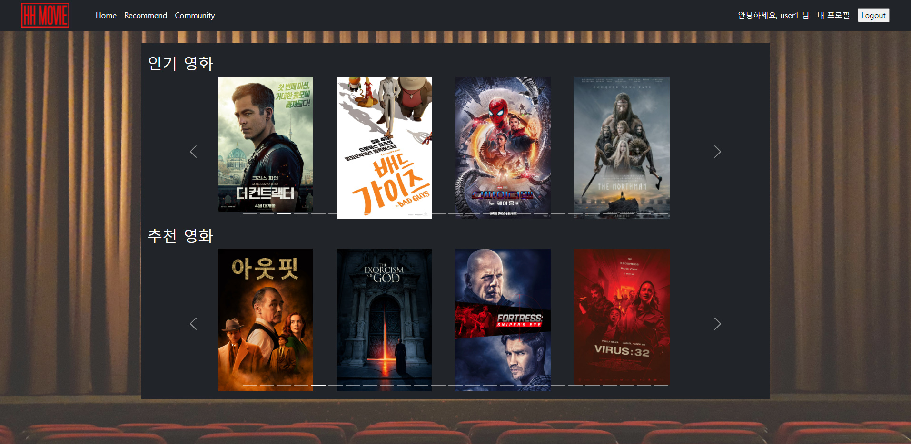

### HH MOVIE 프로젝트

----------------
#### 1. 팀원 정보 및 업무 분담 내역
- 이준호 - 팀장

	- 프론트엔드 담당, 
- 조영훈
  - 백엔드 담당, 


#### 2. 일정 계획 표


##### - 일정 수립(5월 20일(금) 오후)

##### - 최종 점검(5월 25일(수) 오전)

##### - 중간 점검(5월 26일(목) 오후)


#### 3. 일자별 활동(일자별 업데이트 예정)

##### - 5월 20일(금) 오후

----------------


- 프로젝트 기간(05.20 ~ 05.26) 일정 수립(오전, 오후 분할)


  - 1차 중간 점검 이전(~ 5월 25일(수) 오전) : 일정 수립, 아이디어 회의, 모델/기능 구현
  - 최종 점검 이전(~ 5월 26일(목) 오후) : 아이디어 회의, 기능 구현, 디자인 요소
  - 보완 및 피드백(5월 26일(목) 오후)


- ERD 작성, DB 설계(업데이트 예정)


  - TMBD API 자료에서 영화 DB 반영
    - title
    
    - overview
    
    - genre(genre_ids에서 도출)
    
    - poster_path
    
    - video_url 등


  - dumpdata, loaddata로 데이터 저장하기, 불러오기 확인


  - 아이디어 회의
    - 추천 알고리즘을 어떻게 구성하면 좋을 것인가?
      - 코딩 관련된 영화를 추천해도 될 것 같다.
      - 알고리즘을 여러 개를 구현하여 재미를 주어도 좋겠다.
      - 사용자의 의도와 반대로 작용하여 색다른 경험을 하게 만드는 것도 재미있을 것 같다.
    - 기능 상 구현하고 싶었던 것은 무엇이 있는가?
      - 회원가입시 사용자의 지역을 정보로 받아, 현재 상영영화일 경우 예매처로 이동할 수 있게 만들었으면 좋겠다.
    - 이스터에그와 같은 독특한 경험도 주었으면 좋겠다.
    - 디자인적 요소의 경우, UX가 좋다고 평가되는 다른 OTT 서비스를 참고하여도 좋을 것 같다.
    
    

##### - 5월 23일(월) 오전

---------------------


  - ERD 보충 : models.py의 model 구현에 알맞게 테이블의 인스턴스 변경

  - DB 설계를 위한 dumpdata, loaddata 과정 준비

  - 영화 DB 완성을 위한 감독, 배우의 정보 불러오는 과정

    

    - models.py에 Director, Actor 클래스를 작성한다.

      

    - dump_maker.py를 만들어서 감독과 배우의 정보를 가져와 DB에 입력하여 dump한다.

      

    - 감독 : dumpdata로 DB에서 데이터를 추출한 이후, loaddata로 데이터를 받아 DB에서 확인한 모습 

    

    - 배우 : dumpdata로 DB에서 데이터를 추출한 이후, loaddata로 데이터를 받아 DB에서 확인한 모습 

    

    - 실제 화면에서 볼 수 있게 views.py에서 임시 화면 구성

    

    -  실제 감독, 배우들을 출력한 화면

  - 화면구성 -> 오후로 일정 변경


##### - 5월 23일(월) 오후

-------------------


  - 화면 구성 아이디어 회의 및 간단한 배치(향후 수정)

    

    - 로고, navBar(로그아웃, 회원정보수정, 회원탈퇴 등), 영화 포스터, 제목, 링크 등 설정하기

    

    - 영화 제목 클릭 시 title, overview, Director, Actor등이 담긴 Detail 페이지로 이동

  - 모델 - 영화, 감독, 배우의 테이블 구현

    

    - Movie, Director, Actor 및 Comment 모델 항목 보완

    

    - db.sqlite3에 저장된 테이블의 속성들


---------------------------


__Trouble Shooting__

- 문제상황 1 : BASE_URL 초기화 현상 발생

  - 원인 : 2중 포문을 사용하면서 BASE_URL 초기화

    ```python
    BASE_URL = 'https://api.themoviedb.org/3'
    BASE_URL = 'https://api.themoviedb.org/3/movie/'
    BASE_URL = 'https://api.themoviedb.org/3/person/'
    ```

    이러한 형태로 같은 변수명을 사용하다보니, 할당된 값이 의도치 않게 바뀌었습니다.
    
  - 해결 방안 : 각각 다른 변수명을 사용
  
    ```python
    BASE_URL = 'https://api.themoviedb.org/3'
    BASE_URL2 = 'https://api.themoviedb.org/3/movie/'
    BASE_URL3 = 'https://api.themoviedb.org/3/person/'
    ```
  
    
  
  - 느낀점 : path 변수명을 이용해서 조금 더 구체적으로 작성했으면 BASE_URL 변경 없이 클린코드를 작성할 수 있을 것이라 판단했습니다.
  
    ```python
    BASE_URL='https://api.themoviedb.org/3/'
    path = ['/movies', '/person', '/credits']
    params = {
        'api_key' : 'b423b9f62c2dcbbc988e246c89249738',
        'language' : 'ko-KR',
    }
    ```


- 문제상황 2: 같은 값이 Movie_id별로 5개씩 중복돼서 Json파일로 반환되는 현상 발생
  - 원인: fields명 위치가 잘못되어, 같은 fields에 계속해서 새로운 값을 덮어씌우고 있었음
  - 해결방안 : 첫번째 for문 뒤에 선언되어있던 fields명을 두번째 for 문 뒤로 변경
    
  - 느낀점 : 디버깅의 중요성, 한 줄 한 줄 눈으로 코드를 확인하면서 어느 부분이 잘못되었는지 계산해보았습니다. 같은 값이 반복될 때는 변수의 위치가 정확한지 한번 더 확인하는 습관을 길러야겠습니다.

##### - 5월 24일(화) 오전

-------------------


 - 알고리즘 설계 피드백, 회의를 통한 보충
   - 좋아요를 바탕으로 '~를 좋아하신다면 추천!'의 형식으로 추천 알고리즘 보충
   - 그 외 추천 알고리즘 관련 추가 회의 진행
     - 좋아요도 세분화하여 감독, 배우, 영화에 따라 각각 추천하는 알고리즘 고려
     - 사용자의 의도와 반대로 작용하여 색다른 경험을 주는 게임 형식의 추천 고려

 - 화면 구성 아이디어 회의를 통해 화면 구성을 임시로 적용함.



- 첫 시작 화면 구성

  - navBar

    - 좌측 : 로고, 홈, 추천영화, 커뮤니티
    - 우측 : 사용자 인사, 프로필, 로그아웃 등

  - 배경 적용을 통하여 직접 영화관에 온 듯한 효과

  - Carousel을 이용하여 시간마다 영화 추천 영역이 넘어가면서 변경된다.

  - 영화 포스터를 누르면 상세페이지로 이동한다.

    

- 디테일 페이지 구성

  - 상세 페이지로 이동함과 동시에 유튜브 영상이 자동재생된다.
  - Container 구성
    - 왼쪽 : 영화 포스터
    - 오른쪽 : 영화 제목, 평점, 장르, 개봉일, 줄거리, 감독 라인업(사진, 이름), 배우 라인업(사진, 역할, 이름)을 배치한다.
    - 아래쪽에 댓글 창을 만들어 간단한 리뷰 형식의 댓글을 달 수 있도록 한다.
    - 배경화면으로 backdrop_path를 활용한다.

- 그 외 페이지(로그인, 회원가입, 영화추천, 커뮤니티 등) 작성 예정

##### - 5월 24일(화) 오후

-------------------


 - 모델을 구현하고, 기존 ERD에서 작성한 models.py의 속성값 보충
 - 로그인, 로그아웃 기능 구현
   - 디자인적 요소 추후 작성 필요, form.as_p의 양식을 바꾸어야 함
 - 유저 CRUD는 명세서 상 admin에서만 작성하는 기능으로, 제외하기로 하였음
 - 댓글 CRUD의 경우, 영화 리뷰형식으로 남기도록 구현하였음
 - 추천 알고리즘 작성에 핵심이 되는 좋아요를 우선적으로 구현하기로 함.
 - movies/models.py 
!
 - movies/models.py 


----------------

__TROUBLE SHOOTING__

- 로그인하지 않은 상태에서 영화 좋아요를 눌렀을 때, 서버에서는 login으로 이동한다고 나오지만 브라우저에서는 로그인 페이지로 이동되지 않는 문제 발생

  - 원인 : 비동기처리와 새 페이지 렌더링은 모순 관계였기 때문입니다. axios 비동기통신은 모든 화면을 렌더링하고 데이터 하나만 바꾸기 위해서 존재하는데(새로고침 없이), 비로그인 시 accounts/login.html로 새로운 페이지를 전체 렌더링하는 요청을 보냈기 때문에 페이지 변화가 없었던 것입니다.

  - 해결 방안 : index.html 내 비로그인 유저라면, 아예 좋아요 기능이 활성화되지 않도록 바꾸었습니다.

    ```html
    
        <div>
            <form class="like-form" data-movie-id="{{ movie.pk }}">
                
                
                  <button>
                    <i id="like-{{ movie.pk }}" class="fa-solid fa-heart" style="color:red"></i>
                  </button>
                
                  <button>
                    <i id="like-{{ movie.pk }}" class="fa-solid fa-heart" style="color:black"></i>
                  </button>
                
            </form>
        </div>
    ```


- 감독 좋아요 버튼을 눌렀을 때, 404 오류, 페이지를 찾지 못하는 현상

  - 원인 : get_object_or_404에서 director를 불러오지 못했음. pk=director_pk로 명시되어있어 index=director_고유번호 식으로 설정해두어 DB에서 찾지 못했습니다.

  - 해결 방안

    ```python
    director = get_object_or_404(Director, director_id=director_pk)
    ```


- 감독 좋아요 & 유저 매핑 시, director_id가 아니라 index와 결합되는 현상 발생

  - 원인 : 모델 설계 실수. Movie의 경우에도, id필드를 따로 설정하지 않고 받아왔었는데 Director와 Actor는 director_id와 actor_id를 따로 받아왔기 때문에 index와 id가 같이 DB에 저장되어 혼동됐다.

  - 해결 방안

    

    1. 모델 재설계 - Director_id와 Actor_id 삭제
    2. Views.py 재설계 - director_id가 아니라 pk로 복구
